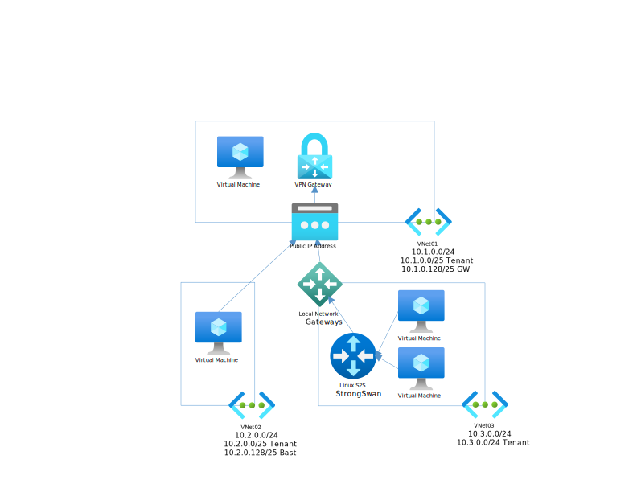

# Multi-VNet Infrastructure Deployment for Azure China

This Bicep template deploys a multi-VNet infrastructure in Azure China (China North 3) with VPN connectivity for hybrid networking scenarios.

## Architecture



## Overview

The deployment creates three virtual networks with the following components:

- **VNet01 (Hub)**: Central hub with VPN Gateway for P2S and S2S connectivity
- **VNet02 (Spoke)**: Windows 11 workstation accessible via Azure Bastion
- **VNet03 (Spoke)**: Linux VMs including a strongSwan-based VPN router for S2S connection

## Network Topology

| VNet | Address Space | Purpose |
|------|---------------|---------|
| VNet01 | 10.1.0.0/24 | Hub - VPN Gateway & Ubuntu VM |
| VNet02 | 10.2.0.0/24 | Spoke - Windows 11 & Bastion |
| VNet03 | 10.3.0.0/24 | Spoke - Ubuntu VM & Linux Router |

## Subnets

| VNet | Subnet Name | Address Range | Purpose |
|------|-------------|---------------|---------|
| VNet01 | Tenant | 10.1.0.0/25 | Workload VMs |
| VNet01 | GatewaySubnet | 10.1.0.128/25 | VPN Gateway |
| VNet02 | Tenant | 10.2.0.0/25 | Workload VMs |
| VNet02 | AzureBastionSubnet | 10.2.0.128/25 | Azure Bastion |
| VNet03 | Tenant | 10.3.0.0/24 | Workload VMs & Router |

## Resources

### VNet01 Resources

| Resource | Name | Type | IP Address |
|----------|------|------|------------|
| Virtual Network | VNet01 | Microsoft.Network/virtualNetworks | 10.1.0.0/24 |
| VPN Gateway | VNet01-gw-vpn | Microsoft.Network/virtualNetworkGateways | Dynamic (Public IP) |
| VPN Gateway Public IP | VNet01-gw-vpn-pip | Microsoft.Network/publicIPAddresses | *Assigned at deployment* |
| Ubuntu VM | VNet01-VM01 | Microsoft.Compute/virtualMachines | Dynamic (10.1.0.0/25) |
| VM NIC | VNet01-VM01-nic | Microsoft.Network/networkInterfaces | Dynamic |

### VNet02 Resources

| Resource | Name | Type | IP Address |
|----------|------|------|------------|
| Virtual Network | VNet02 | Microsoft.Network/virtualNetworks | 10.2.0.0/24 |
| Bastion Host | VNet02-bastion | Microsoft.Network/bastionHosts | N/A |
| Bastion Public IP | VNet02-bastion-pip | Microsoft.Network/publicIPAddresses | *Assigned at deployment* |
| Windows 11 VM | VNet02-VM01 | Microsoft.Compute/virtualMachines | Dynamic (10.2.0.0/25) |
| VM NIC | VNet02-VM01-nic | Microsoft.Network/networkInterfaces | Dynamic |

### VNet03 Resources

| Resource | Name | Type | IP Address |
|----------|------|------|------------|
| Virtual Network | VNet03 | Microsoft.Network/virtualNetworks | 10.3.0.0/24 |
| Ubuntu VM | VNet03-VM01 | Microsoft.Compute/virtualMachines | Dynamic (10.3.0.0/24) |
| VM NIC | VNet03-VM01-nic | Microsoft.Network/networkInterfaces | Dynamic |
| Linux Router | VNet03-router01 | Microsoft.Compute/virtualMachines | Dynamic (10.3.0.0/24) |
| Router NIC | VNet03-router01-nic | Microsoft.Network/networkInterfaces | Dynamic |
| Router Public IP | VNet03-router01-pip | Microsoft.Network/publicIPAddresses | *Assigned at deployment* |

### VPN Resources

| Resource | Name | Type | Purpose |
|----------|------|------|---------|
| Local Network Gateway | VNet01-lng-vnet03-router | Microsoft.Network/localNetworkGateways | Represents VNet03 router |
| VPN Connection | VNet01-conn-vnet03-s2s | Microsoft.Network/connections | S2S IPsec tunnel |

## VPN Configuration

### Point-to-Site (P2S) VPN

| Setting | Value |
|---------|-------|
| Authentication | Entra ID (Azure AD) |
| Protocol | OpenVPN |
| Client Address Pool | 172.16.0.0/24 |
| NAT Pool | 192.168.10.0/24 |
| Gateway SKU | VpnGw2AZ (Generation 2) |

### Site-to-Site (S2S) VPN

| Setting | Value |
|---------|-------|
| Authentication | Pre-Shared Key (PSK) |
| Protocol | IKEv2 |
| Local Network | 10.3.0.0/24 (VNet03) |
| Router Software | strongSwan on Ubuntu 22.04 |

## VM Specifications

| VM Name | OS | Size | Purpose |
|---------|-----|------|---------|
| VNet01-VM01 | Ubuntu 22.04 LTS | Standard_B1s | Workload |
| VNet02-VM01 | Windows 11 23H2 Pro | Standard_B2s | P2S VPN Client |
| VNet03-VM01 | Ubuntu 22.04 LTS | Standard_B1s | Workload |
| VNet03-router01 | Ubuntu 22.04 LTS | Standard_B2s | S2S VPN Router |

## Prerequisites

- Azure China subscription
- Azure PowerShell module (`Az`)
- Entra ID Tenant ID

## Deployment

### From VS Code PowerShell Terminal

```powershell
# Connect to Azure China
Connect-AzAccount -Environment AzureChinaCloud

# Navigate to project folder
cd c:\Bin\Git\Projects\MCCert

# Run deployment script
./deploy.ps1
```

### Parameters Required

| Parameter | Description | Example |
|-----------|-------------|---------|
| adminPassword | Password for all VMs | *Prompted securely* |
| aadTenantId | Entra ID Tenant GUID | xxxxxxxx-xxxx-xxxx-xxxx-xxxxxxxxxxxx |
| vpnSharedKey | S2S VPN Pre-Shared Key | *Prompted securely* |

## Post-Deployment Configuration

### 1. Configure P2S VPN Client

1. Navigate to Azure Portal → VNet01-gw-vpn → Point-to-site configuration
2. Download VPN client
3. Install on Windows 11 VM (VNet02-VM01) or local machine

### 2. Configure strongSwan Router (VNet03-router01)

SSH to the router and edit `/etc/ipsec.conf`:

```conf
config setup
    charondebug="ike 2, knl 2, cfg 2"

conn azure-vpn
    keyexchange=ikev2
    authby=secret
    left=%defaultroute
    leftid=<ROUTER_PUBLIC_IP>
    leftsubnet=10.3.0.0/24
    right=<VPN_GATEWAY_PUBLIC_IP>
    rightsubnet=10.1.0.0/24
    ike=aes256-sha256-modp1024
    esp=aes256-sha256
    auto=start
```

Edit `/etc/ipsec.secrets`:

```
<ROUTER_PUBLIC_IP> <VPN_GATEWAY_PUBLIC_IP> : PSK "your-preshared-key"
```

Restart strongSwan:

```bash
sudo ipsec restart
sudo ipsec status
```

### 3. Access Windows VM

1. Navigate to Azure Portal → VNet02-VM01
2. Click **Connect** → **Bastion**
3. Enter username: `azureuser` and your password

## Estimated Deployment Time

| Resource | Time |
|----------|------|
| Virtual Networks | 1-2 minutes |
| Virtual Machines | 5-10 minutes |
| Azure Bastion | 5-10 minutes |
| VPN Gateway | 30-45 minutes |
| **Total** | **~45-60 minutes** |

## Cost Considerations

| Resource | SKU | Estimated Monthly Cost |
|----------|-----|------------------------|
| VPN Gateway | VpnGw2AZ | ~$300 USD |
| Azure Bastion | Basic | ~$140 USD |
| VMs (4x) | B1s/B2s | ~$50-100 USD |
| Public IPs (3x) | Standard | ~$15 USD |

*Costs are estimates for Azure China. Actual costs may vary.*

## Files

| File | Description |
|------|-------------|
| main.bicep | Main Bicep template |
| main.bicepparam | Parameters file |
| deploy.ps1 | PowerShell deployment script |
| media/Setup.svg | Architecture diagram |

## Troubleshooting

### VPN Gateway deployment fails
- Ensure GatewaySubnet is at least /27 (we use /25)
- VPN Gateway can take up to 45 minutes to provision

### Cannot connect P2S VPN
- Verify Entra ID Tenant ID is correct
- Ensure Azure VPN Enterprise App is registered in your tenant

### S2S VPN not connecting
- Check strongSwan logs: `sudo journalctl -u strongswan`
- Verify PSK matches on both ends
- Ensure router has IP forwarding enabled

## License

MIT