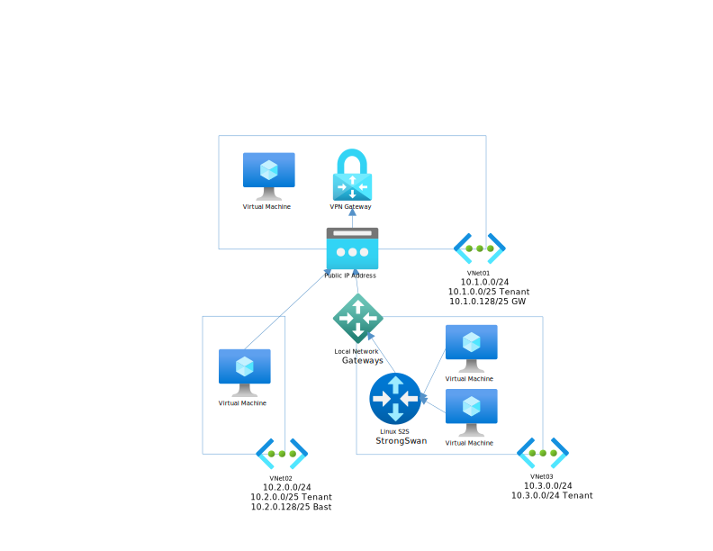

# Multi-VNet Infrastructure Deployment for Azure China

This Bicep template deploys a multi-VNet infrastructure in Azure China (China North 3) with VPN connectivity for hybrid networking scenarios.

## Architecture



## Overview

The deployment creates three virtual networks with the following components:

- **VNet01 (Hub)**: Central hub with VPN Gateway for P2S and S2S connectivity
- **VNet02 (Spoke)**: Windows 11 workstation accessible via Azure Bastion
- **VNet03 (Spoke)**: Linux VMs with automated strongSwan-based VPN router for S2S connection
- **VMSS**: Single Virtual Machine Scale Set managing all VM instances with Flexible orchestration

## Network Topology

| VNet | Address Space | Purpose |
| ---- | ------------- | ------- |
| VNet01 | 10.1.0.0/24 | Hub - VPN Gateway & Ubuntu VM |
| VNet02 | 10.2.0.0/24 | Spoke - Windows 11 & Bastion |
| VNet03 | 10.3.0.0/24 | Spoke - Ubuntu VM & Linux Router |

## Subnets

| VNet | Subnet Name | Address Range | Purpose |
| ---- | ----------- | ------------- | ------- |
| VNet01 | Tenant | 10.1.0.0/25 | Workload VMs |
| VNet01 | GatewaySubnet | 10.1.0.128/25 | VPN Gateway |
| VNet02 | Tenant | 10.2.0.0/25 | Workload VMs |
| VNet02 | AzureBastionSubnet | 10.2.0.128/25 | Azure Bastion |
| VNet03 | Tenant | 10.3.0.0/25 | Workload VMs |
| VNet03 | VPN | 10.3.0.128/25 | VPN Router & UDR |

## Resources

### VNet01 Resources

| Resource | Name | Type | IP Address |
| -------- | ---- | ---- | ---------- |
| Virtual Network | VNet01 | Microsoft.Network/virtualNetworks | 10.1.0.0/24 |
| VPN Gateway | VNet01-gw-vpn | Microsoft.Network/virtualNetworkGateways | Dynamic (Public IP) |
| VPN Gateway Public IP | VNet01-gw-vpn-pip | Microsoft.Network/publicIPAddresses | *Assigned at deployment* |
| Ubuntu VM (VMSS Instance) | VNet01-VM01 | Microsoft.Compute/virtualMachines | Dynamic (10.1.0.0/25) |
| VM NIC | VNet01-VM01-nic | Microsoft.Network/networkInterfaces | Dynamic |

### VNet02 Resources

| Resource | Name | Type | IP Address |
| -------- | ---- | ---- | ---------- |
| Virtual Network | VNet02 | Microsoft.Network/virtualNetworks | 10.2.0.0/24 |
| Bastion Host | VNet02-bastion | Microsoft.Network/bastionHosts | N/A |
| Bastion Public IP | VNet02-bastion-pip | Microsoft.Network/publicIPAddresses | *Assigned at deployment* |
| Windows 11 VM (VMSS Instance) | VNet02-VM01 | Microsoft.Compute/virtualMachines | Dynamic (10.2.0.0/25) |
| VM NIC | VNet02-VM01-nic | Microsoft.Network/networkInterfaces | Dynamic |

### VNet03 Resources

| Resource | Name | Type | IP Address |
| -------- | ---- | ---- | ---------- |
| Virtual Network | VNet03 | Microsoft.Network/virtualNetworks | 10.3.0.0/24 |
| Route Table | VNet03-tenant-rt | Microsoft.Network/routeTables | Routes 10.1.0.0/24 to router |
| Ubuntu VM (VMSS Instance) | VNet03-VM01 | Microsoft.Compute/virtualMachines | Dynamic (10.3.0.0/25 - Tenant) |
| VM NIC | VNet03-VM01-nic | Microsoft.Network/networkInterfaces | Dynamic |
| Linux Router (VMSS Instance) | VNet03-router01 | Microsoft.Compute/virtualMachines | Dynamic (10.3.0.128/25 - VPN) |
| Router NIC | VNet03-router01-nic | Microsoft.Network/networkInterfaces | Dynamic |
| Router Public IP | VNet03-router01-pip | Microsoft.Network/publicIPAddresses | *Assigned at deployment* |

### Security Resources

| Resource | Name | Type | Purpose |
| -------- | ---- | ---- | ------- |
| Key Vault | kv-vpngw-{uniqueString} | Microsoft.KeyVault/vaults | Secure storage for VM passwords and VPN keys |
| Secret | vm-admin-password | Key Vault Secret | Admin password for all VMs |
| Secret | vpn-shared-key | Key Vault Secret | Pre-shared key for S2S VPN |

### VMSS Resources

| Resource | Name | Type | Purpose |
| -------- | ---- | ---- | ------- |
| Virtual Machine Scale Set | VPNGWJonVMSS | Microsoft.Compute/virtualMachineScaleSets | Flexible orchestration for all VMs |
| VM Instance | VNet01-VM01 | Microsoft.Compute/virtualMachines | Ubuntu workload VM |
| VM Instance | VNet02-VM01 | Microsoft.Compute/virtualMachines | Windows 11 P2S client VM |
| VM Instance | VNet03-VM01 | Microsoft.Compute/virtualMachines | Ubuntu workload VM |
| VM Instance | VNet03-router01 | Microsoft.Compute/virtualMachines | strongSwan S2S VPN router |

### VPN Resources

| Resource | Name | Type | Purpose |
| -------- | ---- | ---- | ------- |
| Local Network Gateway | VNet01-lng-vnet03-router | Microsoft.Network/localNetworkGateways | Represents VNet03 router |
| VPN Connection | VNet01-conn-vnet03-s2s | Microsoft.Network/connections | S2S IPsec tunnel |

## VPN Configuration

### Point-to-Site (P2S) VPN

| Setting | Value |
| ------- | ----- |
| Authentication | Entra ID (Azure AD) |
| Protocol | OpenVPN |
| Client Address Pool | 172.16.0.0/24 |
| NAT Pool | 192.168.10.0/24 |
| Gateway SKU | VpnGw2AZ (Generation 2) |

### Site-to-Site (S2S) VPN

| Setting | Value |
| ------- | ----- |
| Authentication | Pre-Shared Key (PSK) |
| Protocol | IKEv2 |
| Local Network | 10.3.0.0/24 (VNet03) |
| Router Software | strongSwan on Ubuntu 22.04 |

## VM Specifications

| VM Name | OS | Size | Purpose | VMSS Instance |
| ------- | -- | ---- | ------- | ------------- |
| VNet01-VM01 | Ubuntu 22.04 LTS | Standard_B1s | Workload | ✅ |
| VNet02-VM01 | Windows 11 23H2 Pro | Standard_B2s | P2S VPN Client | ✅ |
| VNet03-VM01 | Ubuntu 22.04 LTS | Standard_B1s | Workload | ✅ |
| VNet03-router01 | Ubuntu 22.04 LTS | Standard_B2s | S2S VPN Router | ✅ |

## Prerequisites

- Azure China subscription
- Azure PowerShell module (`Az`)
- Entra ID Tenant ID

## Deployment

### Two-Phase Deployment Process

This template uses a **two-phase deployment** to ensure secure Key Vault integration:

#### Phase 1: Infrastructure Deployment

```powershell
# Connect to Azure China
Connect-AzAccount -Environment AzureChinaCloud

# Navigate to project folder
cd c:\Bin\Git\Projects\MCCert

# Deploy infrastructure (VNets, Key Vault, VPN Gateway)
# Note: deployVMs = false in main.bicepparam
./deploy.ps1
```

#### Phase 2: Add Secrets & Deploy VMs

```powershell
# Get Key Vault name from deployment output
$kvName = (Get-AzResourceGroupDeployment -ResourceGroupName "your-rg-name" -Name "your-deployment-name").Outputs.keyVaultName.Value

# Add required secrets
az keyvault secret set --vault-name $kvName --name "vm-admin-password" --value "YourSecurePassword123!"
az keyvault secret set --vault-name $kvName --name "vpn-shared-key" --value "YourVpnSharedKey123!"

# Update deployVMs = true in main.bicepparam
# Then redeploy to create VMs
./deploy.ps1
```

### Parameters Required

| Parameter | Description | Example |
| --------- | ----------- | ------- |
| deployVMs | Controls VM deployment phase | false (Phase 1), true (Phase 2) |
| aadTenantId | Entra ID Tenant GUID | xxxxxxxx-xxxx-xxxx-xxxx-xxxxxxxxxxxx |

*Note: Sensitive parameters are stored securely in Key Vault.*

## Post-Deployment Configuration

### 1. Configure P2S VPN Client

1. Navigate to Azure Portal → VNet01-gw-vpn → Point-to-site configuration
2. Download VPN client
3. Install on Windows 11 VM (VNet02-VM01) or local machine

### 2. strongSwan Router Configuration (Automated)

The strongSwan router (VNet03-router01) is **automatically configured** during deployment with:

- **Fully automated IPsec configuration** using actual public IP addresses
- **Pre-shared key** automatically retrieved from Key Vault
- **Auto-start VPN tunnel** on boot
- **IP forwarding enabled** for traffic routing
- **User Defined Route (UDR)** on Tenant subnet forwards 10.1.0.0/24 traffic to router

No manual configuration required! The S2S VPN tunnel will establish automatically once Key Vault secrets are populated.

**To verify connection status:**

```bash
# SSH to VNet03-router01 and check status
sudo ipsec status
sudo journalctl -u strongswan -f
```

### 3. Access Windows VM

1. Navigate to Azure Portal → VNet02-VM01
2. Click **Connect** → **Bastion**
3. Enter username: `azureuser` and your password

## Estimated Deployment Time

### Phase 1 (Infrastructure)

| Resource | Time |
| -------- | ---- |
| Virtual Networks | 1-2 minutes |
| Key Vault | 1-2 minutes |
| Azure Bastion | 5-10 minutes |
| VPN Gateway | 30-45 minutes |
| **Phase 1 Total** | **~40-55 minutes** |

### Phase 2 (VMs + Secret Validation)

| Resource | Time |
| -------- | ---- |
| Secret Validation | 1-2 minutes |
| Virtual Machine Scale Set | 2-3 minutes |
| VM Instances (4x) | 5-10 minutes |
| **Phase 2 Total** | **~8-15 minutes** |

### Total Deployment Time: ~50-70 minutes

## Cost Considerations

| Resource | SKU | Estimated Monthly Cost |
| -------- | --- | ---------------------- |
| VPN Gateway | VpnGw2AZ | ~$300 USD |
| Azure Bastion | Basic | ~$140 USD |
| VMSS (4 instances) | B1s/B2s | ~$50-100 USD |
| Public IPs (3x) | Standard | ~$15 USD |

*Costs are estimates for Azure China. Actual costs may vary.*

## Files

| File | Description |
| ---- | ----------- |
| main.bicep | Main Bicep template |
| main.bicepparam | Parameters file |
| deploy.ps1 | PowerShell deployment script |
| media/Setup.svg | Architecture diagram |

## Troubleshooting

### VPN Gateway deployment fails

- Ensure GatewaySubnet is at least /27 (we use /25)
- VPN Gateway can take up to 45 minutes to provision

### Cannot connect P2S VPN

- Verify Entra ID Tenant ID is correct
- Ensure Azure VPN Enterprise App is registered in your tenant

### S2S VPN not connecting

- Check strongSwan logs: `sudo journalctl -u strongswan`
- Verify PSK matches on both ends
- Ensure router has IP forwarding enabled

## License

MIT
