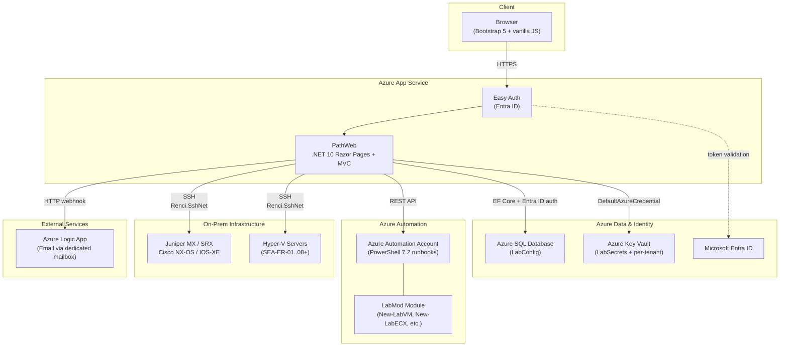
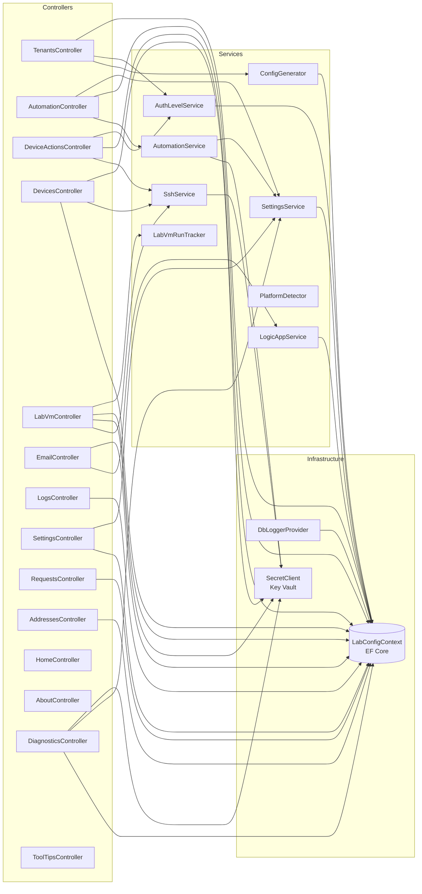
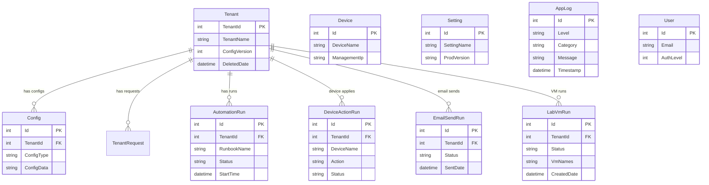
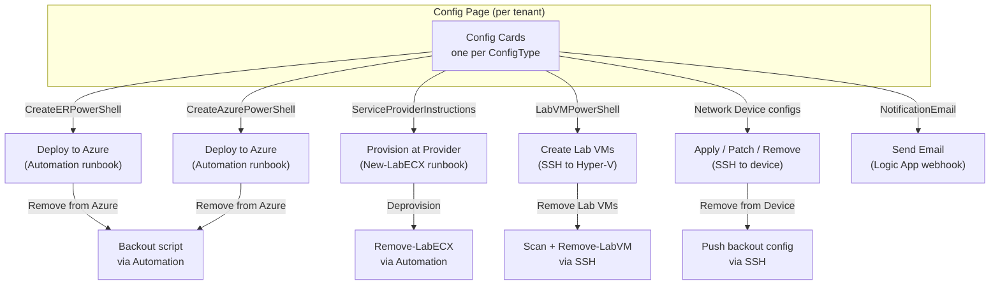
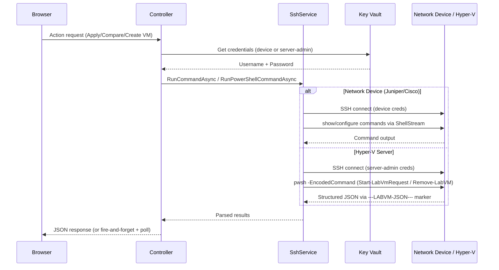
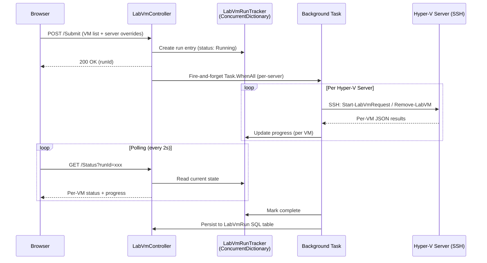
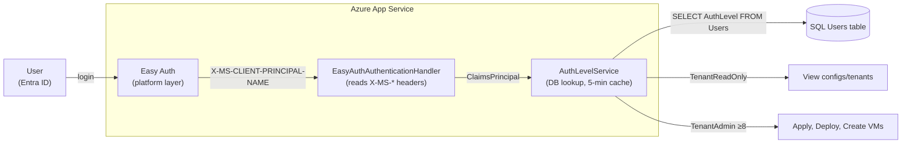
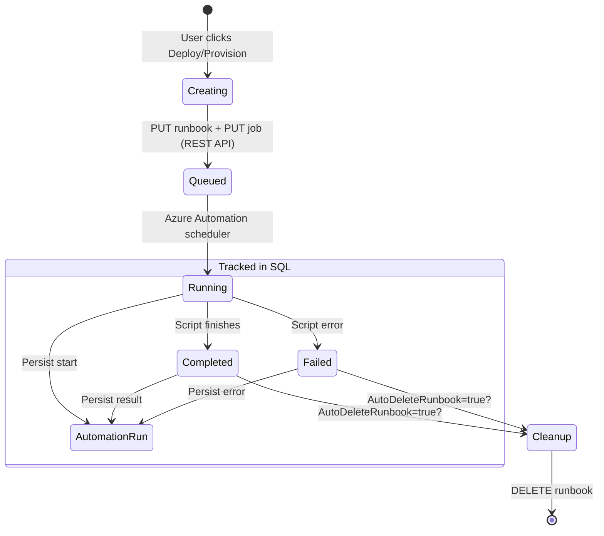

# PathWeb — Architecture Diagrams

> Generated from the codebase structure. Render these Mermaid diagrams on GitHub, in VS Code (Mermaid extension), or paste into [mermaid.live](https://mermaid.live) to export as SVG/PNG.

---

## 1. High-Level System Architecture

---

## 2. Controller & Service Dependency Graph

---

## 3. Data Model (Key SQL Tables)

---

## 4. Config Card Actions Flow

---

## 5. SSH Operations Architecture

---

## 6. Lab VM Fire-and-Forget Pattern

---

## 7. Authentication & Authorization Flow

---

## 8. Azure Automation Runbook Lifecycle

---

## How to Export

| Method | Steps |
|--------|-------|
| **GitHub** | Push this file — GitHub renders Mermaid natively in markdown |
| **mermaid.live** | Paste any `mermaid` block at [mermaid.live](https://mermaid.live) → export PNG/SVG |
| **VS Code** | Install "Markdown Preview Mermaid Support" extension → preview this file |
| **draw.io** | Use mermaid.live to export SVG → import into draw.io for further editing |
| **PowerPoint** | Export SVG from mermaid.live → Insert as image in PowerPoint |
